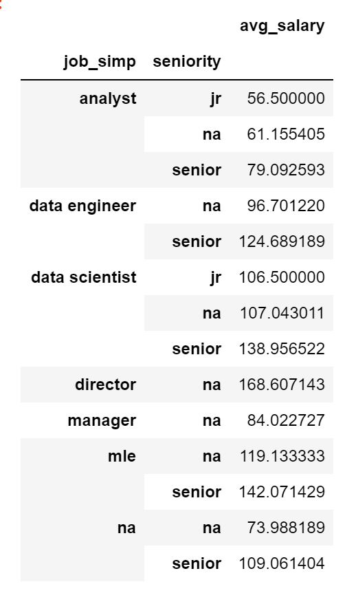
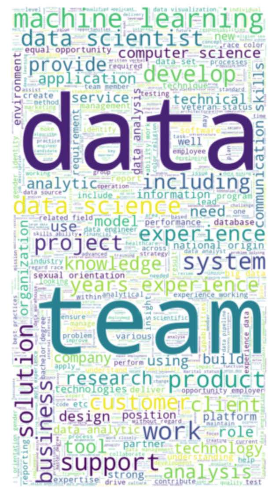
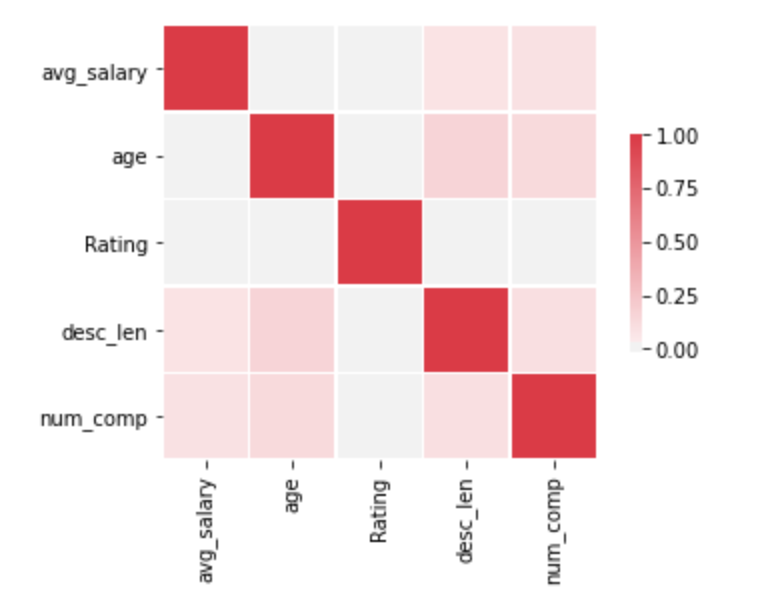

# Data Scientist Salary Estimator based on Glassdoor data: Project Overview
* Built a tool that can help estimating a data scientist salary (helpful for me to know what to expect when landing my first job as DS)
* The data was scraped from Glassdoor using Python/Selenium (USA data). Data from other countries can be used if Glassdoor provid that
* Created additional features from the job description of each job (e.g., python, spark, excel, aws)
* Applying different regression models (linear regression, lasso regression, reandom forest) to the data to find the best model.
* Built a client facing API using flask 

## Programming Language & Packages
* Python
* Packages: numpy, pandas, matplotlib, seanborn, statsmodel, sklearn, selenium, pickle, flask

## Resources
* For Scraping: https://github.com/arapfaik/scraping-glassdoor-selenium 
* Flask Productionization: https://towardsdatascience.com/productionize-a-machine-learning-model-with-flask-and-heroku-8201260503d2

## Data scraped
When scraping the glassdoor.com for data scientist jobs, the following data was collected for each posted job:
* Job title
* Salary Estimate
* Job Description
* Rating
* Company
* Location
* Company Headquarters
* Company Size
* Company Founded Date
* Type of Ownership
* Industry
* Sector
* Revenue
* Competitors

## Data Cleaning
Before applying the data to the Machine Learning models, some data_cleaning was applied to the data and, some extra features was added to the data.
* Removed rows without salary
* Parsed rating out of company text
* Made a new column for company state
* Parsed numeric data out of salary
* Made columns for employer provided salary and hourly wages
* Added a column for if the job was at the company’s headquarters
* Transformed founded date into age of company
* Column for simplified job title and Seniority
* Made columns for if different skills were listed in the job description:
  * Python
  * R
  * Excel
  * AWS
  * Spark
* Column for description length

## Exploratory Data Analysis (EDA)
Checked the distributions and built many pivot tables to answer some questions related to the salray (e.g., salary based on state, salary based on experience, salary based on skills)
I also plot a heatmap for some of the features to check the correlations between them.

   

## Models Building
I started by converting the categorical features into dummy features, and then divding the dataset into train and test sets with train size of 80% and test size of 20%.
I build 3 different models and evaluated them using Mean Abslout Error (MAE). I chose MAE because it is relatively easy to understand and explain and outliers aren’t particularly bad in for this type of model.
The models are:
* Multiple Linear Regression
* Lasso Regression - Because of the sparse data from the many categorical variables, I thought a normalized regression like lasso would be effective.
* Random Forest – Again, I build it for the same reason as the Lasso model (the sparsity associated with the data).

## Models Performance
* Random Forest - MAE = 11.22
* Multiple Linear Regression - MAE = 18.86
* Lasso Regression - MAE = 19.67
From the MAE results we can see that RF model outperfoms the other models, MLR is second best and Lasso model comes last.

## Productionization
I built a flask API endpoint that was hosted on a local server by following along with the 'towords data science' tutorial in the reference section below. The API endpoint takes in a request with a list of values from a job listing and returns an estimated salary.

## Referances
* Data scraping: https://github.com/arapfaik/scraping-glassdoor-selenium/blob/master/glassdoor%20scraping.ipynb
* FlaskAPI : https://towardsdatascience.com/productionize-a-machine-learning-model-with-flask-and-heroku-8201260503d2

